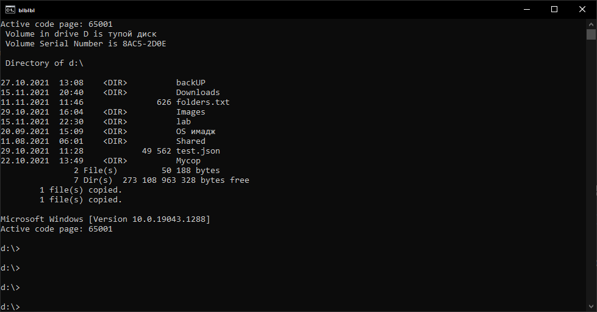

# Batники

## Понятие

**Пакетный файл** (англ. ```batch file```) — текстовый файл в MS-DOS, или Windows, содержащий последовательность команд, предназначенных для исполнения командным интерпретатором. После запуска пакетного файла программа-интерпретатор читает его строка за строкой и последовательно исполняет команды. Пакетный файл — аналог скриптовых файлов командной строки (shell script) в Unix-подобных операционных системах.



Пакетные файлы поддерживают операторы ```if```, ```goto``` и ```for``` (в системах семейства Windows NT его возможности существенно расширены), что позволяет обрабатывать результаты выполнения предыдущих команд или приложений и в зависимости от этого выполнять дальше тот или иной блок команд (как правило, в случае удачного завершения приложение возвращает 0 в переменной errorlevel; в случае неудачного — 1 или большее значение).


## Создание переменных

 Команда **SET** используется для просмотра и изменения переменных среды окружения в командной строке Windows. Переменные окружения - это переменные, принимаемые значения которых характеризуют среду, в которой выполняется текущая программа - пути системных файлов, сведения об аппаратных средствах, каталоги пользователя и т.п. Значения переменных среды формируются в процессе загрузки Windows, регистрации пользователя в системе, при выполнении отдельных процессов или с помощью команды **SET**. Для просмотра значения, принимаемого конкретной переменной можно воспользоваться командой :  
  
**SET переменная**  
**SET PATH** - отобразить значение переменной **PATH**  
Для создания новой переменной, или изменения значения существующей, используется команда :  
  
```shell
SET переменная=строка
```

Например:
```shell
set desc=c:\Users\den\Desktop
```
 
 Для просмотра содержимого:
```shell
set desc
```

Также с помощью ```set``` можно посмотреть перечень всех переменных на данный момент:

```shell
set

ALLUSERSPROFILE=C:\ProgramData
APPDATA=C:\Users\den\AppData\Roaming
CommonProgramFiles=C:\Program Files\Common Files
CommonProgramFiles(x86)=C:\Program Files (x86)\Common Files
CommonProgramW6432=C:\Program Files\Common Files
COMPUTERNAME=DESKTOP-FH4OCQB
ComSpec=C:\Windows\system32\cmd.exe
desc=c:\Users\den\Desktop
DriverData=C:\Windows\System32\Drivers\DriverData
HOMEDRIVE=C:
HOMEPATH=\Users\den
LOCALAPPDATA=C:\Users\den\AppData\Local
LOGONSERVER=\\DESKTOP-FH4OCQB
NUMBER_OF_PROCESSORS=4
OS=Windows_NT
Path=C:\Windows\system32;C:\Windows;C:\Windows\System32\Wbem;C:\Windows\System32\WindowsPowerShell\v1.0\;C:\Windows\System32\OpenSSH\;C:\Program Files\VSCodium\bin;C:\Program Files\Git\cmd;C:\Program Files\mingw-w64\x86_64-8.1.0-posix-seh-rt_v6-rev0\mingw64\bin;C:\Users\den\AppData\Local\Programs\Python\Python37\Scripts\;C:\Users\den\AppData\Local\Programs\Python\Python37\;C:\Users\den\AppData\Local\Programs\Python\Python310\Scripts\;C:\Users\den\AppData\Local\Programs\Python\Python310\;C:\Users\den\AppData\Local\Microsoft\WindowsApps;C:\Program Files\JetBrains\PyCharm 2020.1\bin;
PATHEXT=.COM;.EXE;.BAT;.CMD;.VBS;.VBE;.JS;.JSE;.WSF;.WSH;.MSC
PROCESSOR_ARCHITECTURE=AMD64
PROCESSOR_IDENTIFIER=Intel64 Family 6 Model 61 Stepping 4, GenuineIntel
PROCESSOR_LEVEL=6
PROCESSOR_REVISION=3d04
ProgramData=C:\ProgramData
ProgramFiles=C:\Program Files
ProgramFiles(x86)=C:\Program Files (x86)
ProgramW6432=C:\Program Files
PROMPT=$P$G
PSModulePath=C:\Program Files\WindowsPowerShell\Modules;C:\Windows\system32\WindowsPowerShell\v1.0\Modules
PUBLIC=C:\Users\Public
PyCharm=C:\Program Files\JetBrains\PyCharm 2020.1\bin;
SystemDrive=C:
SystemRoot=C:\Windows
TEMP=C:\Users\den\AppData\Local\Temp
TMP=C:\Users\den\AppData\Local\Temp
USERNAME=den
USERPROFILE=C:\Users\den
VBOX_MSI_INSTALL_PATH=C:\Program Files\Oracle\VirtualBox\
windir=C:\Windows
```

## Использование переменных
Для использования переменных, их нужно прятать в символ ```%```:
```shell
c:\>echo %desc%
c:\Users\den\Desktop
```

Такие переменные можно использовать в разнообразных случаях. Например выше заданная переменная является расположением рабочего стола -- каталогом, в который можно перейти:
```shell
c:\>cd %desc%

c:\Users\den\Desktop>
```

## Разнообразные команды

#### start
Команда ```START``` позволяет запускать приложения в отдельном окне, с возможностью указания некоторых параметров их выполнения.

#### goto
Команда GOTO используется для выполнения безусловного перехода в командном файле.  
  
Формат команды:  
  
**GOTO метка**  
  
Метка представляет собой строку символов, начинающуюся с двоеточия.  
  
Например:
```shell
**@echo off  

. . .  

GOTO M1  

. . .  

:M1  
CALL M2**
```

<div style="page-break-after: always;"></div>

## "конвееры" команд

С помощью > можно перенаправить результат команды в файл:
```shell
dir > file
```

Дополнение файла происходит с помощью >>
```shell
d:\date >> file
d:\time >> file
```

с помощью | можно направить резельтат одной команды на вход другой

```shell
d:\>dir | findstr txt

11.11.2021  11:46               626 folders.txt
```

& выполняет сначала первую команду, затем вторую

```shell
d:\>dir & cd backUP
 Volume in drive D is тупой диск
 Volume Serial Number is 8AC5-2D0E

 Directory of d:\

27.10.2021  13:08    <DIR>          backUP
15.11.2021  20:40    <DIR>          Downloads
11.11.2021  11:46               626 folders.txt
29.10.2021  16:04    <DIR>          Images
20.09.2021  15:09    <DIR>          OS имадж
11.08.2021  06:01    <DIR>          Shared
29.10.2021  11:28            49 562 test.json
22.10.2021  13:49    <DIR>          Мусор
               2 File(s)         50 188 bytes
               6 Dir(s)  273 108 439 040 bytes free

d:\backUP>
```

&& выполняет первую, если она выполнена успешно, выполняет вторую

```shell
d:\>cd backUPs &&  dir
The system cannot find the path specified.
```

```shell
d:\>cd backUP &&  dir
 Volume in drive D is тупой диск
 Volume Serial Number is 8AC5-2D0E

 Directory of d:\backUP

27.10.2021  13:08    <DIR>          .
27.10.2021  13:08    <DIR>          ..
10.07.2021  01:16    <DIR>          adv
10.07.2021  01:16    <DIR>          Android
```

|| выполняет первую, если ее выполнить не удалось, выполняет вторую

```shell
d:\>cd backUPs || cd backUp
The system cannot find the path specified.

d:\backUP>
```

<div style="page-break-after: always;"></div>

## Пример написания bat-файла

```shell
@echo off
chcp 65001
title ыыы

cd /d d:\

mkdir lab

ver > ver.txt
chcp >> ver.txt

type ver.txt

cd d:\

rmdir /s lab

start c:\Users\den\Desktop\test.bat
```

Файл сохранен как run.bat, запускается с помощью команды:
```shell
run.bat
```

<div style="page-break-after: always;"></div>


